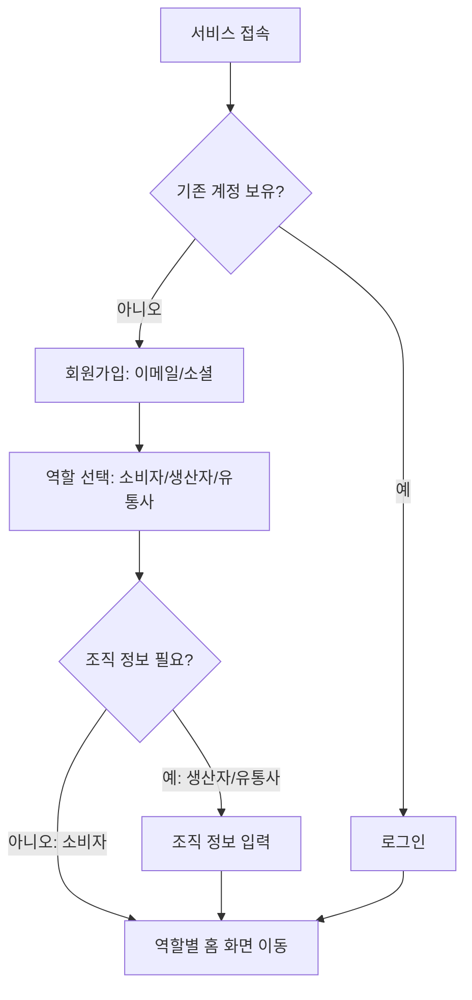
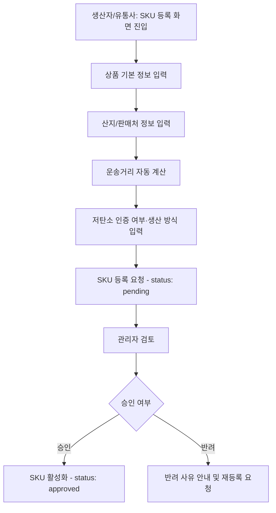
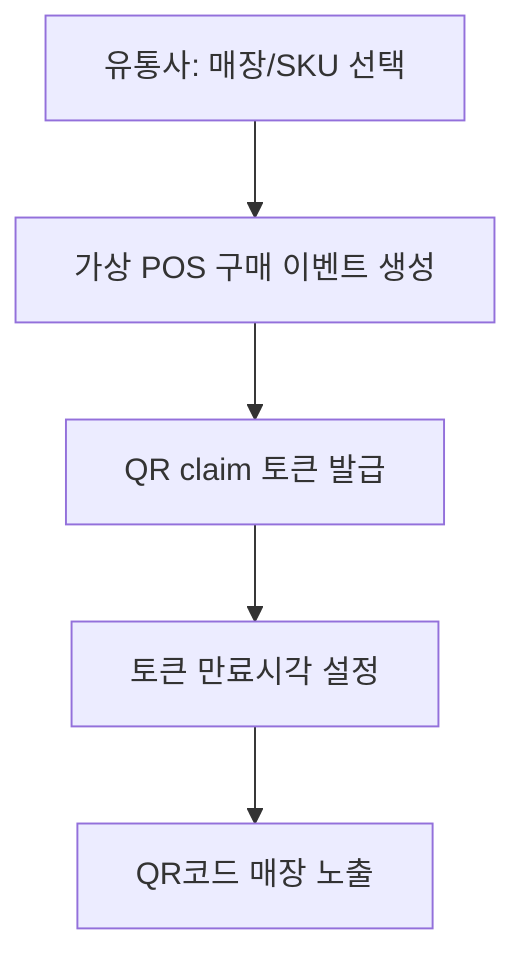
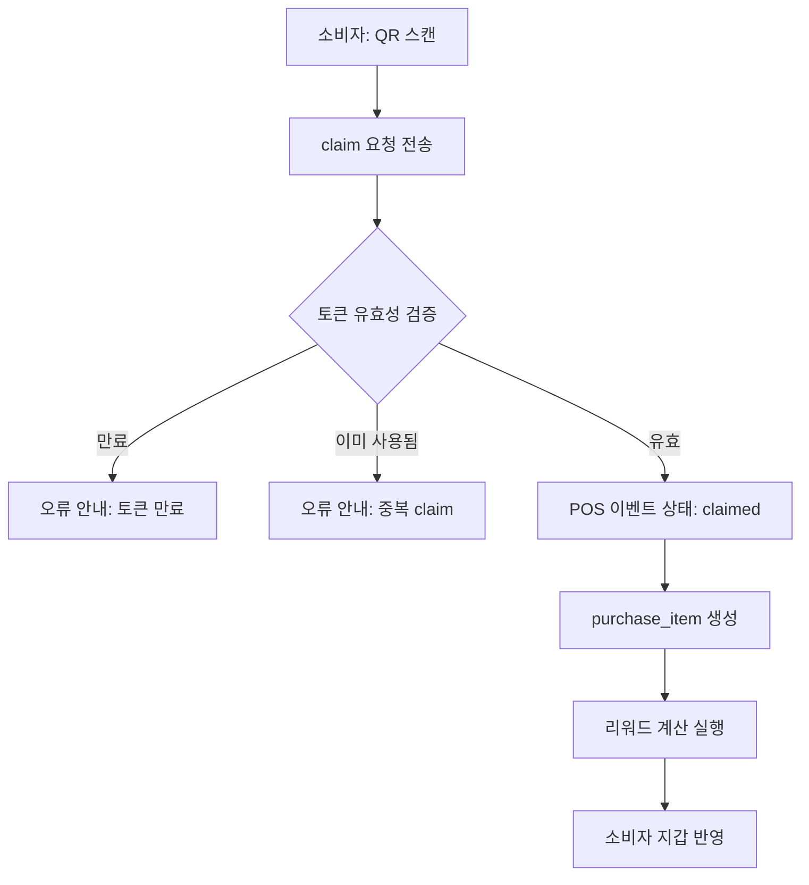
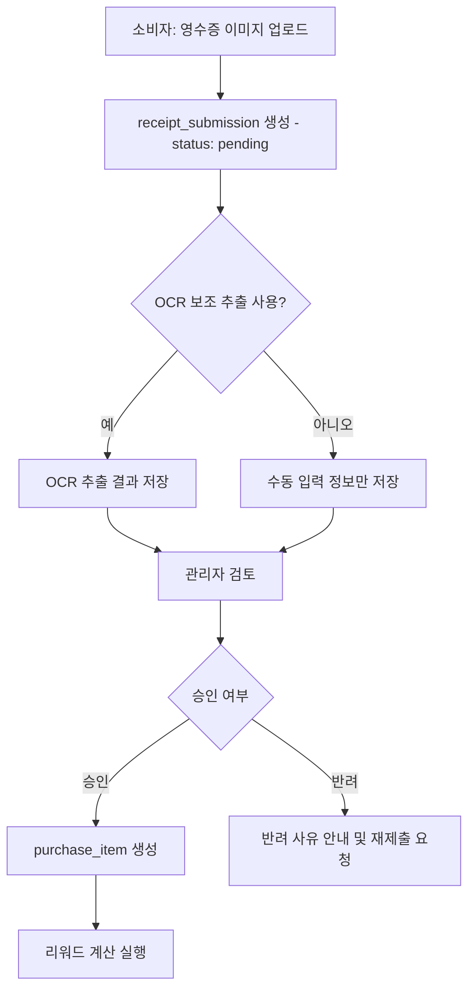
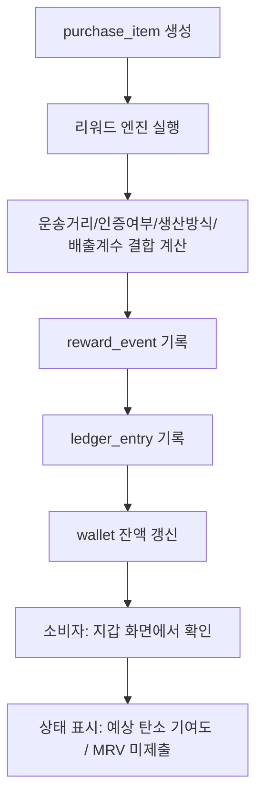
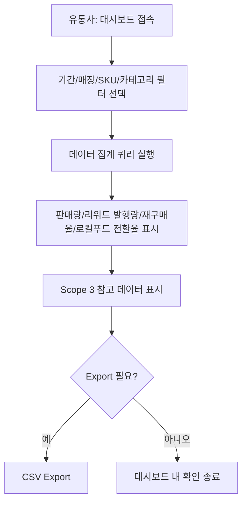
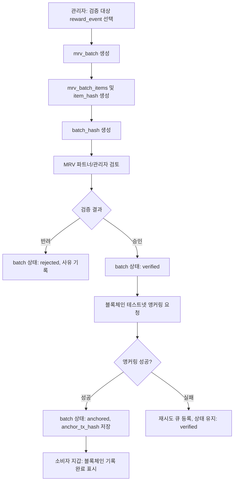
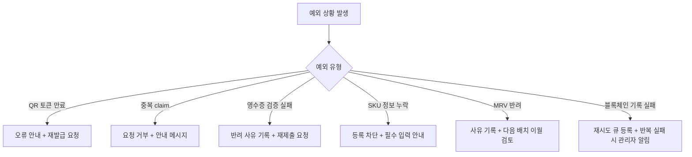
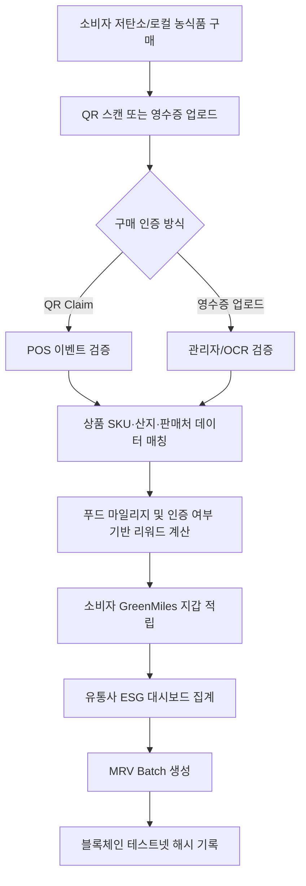

# User Flow: GreenMiles

> 블록체인 기반 농식품 탄소배출권 리워드 플랫폼 — User Flow Document

---

## 목차

1. 문서 개요
2. 사용자 유형별 핵심 플로우 개요
3. 온보딩/로그인 플로우
4. SKU 등록 플로우
5. 가상 POS 구매 이벤트 생성 플로우
6. QR claim 플로우
7. 영수증 업로드 플로우
8. 리워드 산정 및 지갑 반영 플로우
9. 유통사 ESG 대시보드 조회 플로우
10. MRV batch 생성 및 블록체인 기록 플로우
11. 예외 상황 플로우
12. 전체 통합 Mermaid 다이어그램
13. 핵심 요약
14. 다음 액션

---

## 1. 문서 개요

본 문서는 그린마일즈(GreenMiles) 서비스의 사용자 유형별 핵심 행동 흐름을 정의하고, 각 기능이 어떤 순서로 작동하는지 Mermaid 다이어그램으로 시각화한다. 소비자, 유통사, 생산자/농가, 관리자/MRV 파트너의 플로우를 구분하여 작성하며, 정상 플로우뿐 아니라 QR 토큰 만료, 중복 claim, 영수증 검증 실패 등 예외 상황도 포함한다. 모든 플로우는 실제 MVP 범위 안에서 작성되었다.

---

## 2. 사용자 유형별 핵심 플로우 개요

| 사용자 유형 | 핵심 플로우 |
|---|---|
| 소비자 | 회원가입 → QR 스캔/영수증 업로드 → 리워드 적립 확인 → 지갑 조회 |
| 유통사 | 회원가입 → 매장/SKU 등록 → 가상 POS 이벤트 생성 → 대시보드 조회 |
| 생산자/농가 | 회원가입 → 농장/상품 정보 등록 → 승인 대기 → 판매 반응 확인 |
| 관리자/MRV 파트너 | 로그인 → 상품/영수증 검토 → MRV 배치 생성 → 블록체인 기록 확인 |

---

## 3. 온보딩/로그인 플로우

1. 사용자가 회원가입 화면에서 이메일 또는 소셜 로그인으로 가입한다 `[AI 보완]`.
2. 가입 시 역할(소비자/생산자/유통사)을 선택하거나, 관리자가 추후 역할을 부여한다.
3. 유통사/생산자의 경우 조직 정보(매장명, 농장명 등)를 추가 입력한다.
4. 가입 완료 후 역할에 맞는 홈 화면으로 이동한다.

---

## 4. SKU 등록 플로우

1. 생산자 또는 유통사 담당자가 SKU 등록 화면에 접속한다.
2. 상품명, 카테고리, 중량, 산지, 판매처, 저탄소 인증 여부, 생산 방식, 포장 정보를 입력한다.
3. 산지-판매처 거리는 시스템이 자동 계산하여 표시한다.
4. 등록된 SKU는 관리자 승인 대기(pending) 상태가 된다.
5. 관리자가 승인하면 SKU가 활성화되어 가상 POS 이벤트 생성에 사용될 수 있다.

---

## 5. 가상 POS 구매 이벤트 생성 플로우

1. 유통사 담당자가 매장/SKU를 선택하여 가상 POS 구매 이벤트를 생성한다.
2. 시스템이 QR claim 토큰을 발급하고 만료시간을 설정한다.
3. QR코드가 매장 또는 영수증 형태로 소비자에게 노출된다(데모/파일럿 단계에서는 매장 비치형 QR 사용 가능) `[AI 보완]`.

---

## 6. QR claim 플로우

1. 소비자가 매장에 비치된 QR코드를 스캔한다.
2. 시스템이 토큰 유효성, 만료 여부, 중복 사용 여부를 검증한다.
3. 검증 통과 시 pos_event 상태를 claimed로 변경하고 purchase_item을 생성한다.
4. 리워드 계산 로직이 실행되어 소비자 지갑에 포인트가 반영된다.

---

## 7. 영수증 업로드 플로우

1. 소비자가 영수증 이미지를 업로드한다.
2. 시스템(OCR 보조 기능 사용 시)이 판매처, 구매일시, 상품명, 금액을 추출한다 `[AI 보완]`.
3. 관리자가 영수증을 검토하여 승인 또는 반려한다.
4. 승인 시 purchase_item이 생성되고 리워드 계산이 실행된다.
5. 반려 시 소비자에게 사유가 안내되고 재제출이 가능하다.

---

## 8. 리워드 산정 및 지갑 반영 플로우

1. purchase_item이 생성되면 리워드 엔진이 SKU의 운송거리, 인증 여부, 생산 방식, 배출계수를 결합하여 포인트와 예상 탄소 기여도를 계산한다.
2. 계산 결과는 reward_events에 기록되고, ledger_entries에 원장 기록이 추가된다.
3. 소비자 wallets의 잔액이 갱신된다.
4. 소비자는 지갑 화면에서 적립 포인트, 구매 이력, 예상 탄소 기여도, MRV 검증 상태를 확인한다.

---

## 9. 유통사 ESG 대시보드 조회 플로우

1. 유통사 담당자가 대시보드에 접속한다.
2. 기간, 매장, SKU, 카테고리 필터를 선택한다.
3. 시스템이 판매량, 리워드 발행량, 재구매율, 로컬푸드 전환율, Scope 3 참고 데이터를 집계하여 표시한다.
4. 필요 시 CSV로 데이터를 Export한다 `[AI 보완]`.

---

## 10. MRV batch 생성 및 블록체인 기록 플로우

1. 관리자가 일정 기간의 reward_events 중 검증 대상을 선택한다.
2. 선택된 이벤트로 mrv_batch와 mrv_batch_items를 생성하고 각 항목 해시를 계산한다.
3. MRV 파트너 또는 관리자가 배치를 검토하여 verified 상태로 변경한다(또는 반려).
4. verified 배치에 대해 batch_hash를 블록체인 테스트넷에 기록한다.
5. 기록 성공 시 상태가 anchored로 변경되고, 관련 reward_events의 상태도 갱신된다.

---

## 11. 예외 상황 플로우

| 예외 상황 | 처리 방식 |
|---|---|
| QR 토큰 만료 | claim 요청 시 만료 여부 확인 후 오류 안내, 신규 QR 재발급 요청 안내 |
| 중복 claim | 이미 claimed 상태인 토큰에 대한 재요청을 거부하고 안내 메시지 표시 |
| 영수증 검증 실패 | 관리자가 반려 처리 시 사유를 기록하고 소비자에게 안내, 재제출 가능 |
| SKU 정보 누락 | 필수 필드 누락 시 등록 요청을 막고 입력 화면에서 즉시 안내 |
| MRV 반려 | 배치 또는 개별 항목 반려 시 사유를 기록하고 해당 reward_event는 다음 배치로 이월 검토 |
| 블록체인 기록 실패 | 앵커링 트랜잭션 실패 시 상태를 verified로 유지하고 재시도 큐에 등록, 반복 실패 시 관리자에게 알림 `[AI 보완]` |

---

## 12. 전체 통합 Mermaid 다이어그램

---

## 핵심 요약

본 문서는 소비자, 유통사, 생산자/농가, 관리자/MRV 파트너의 핵심 플로우를 온보딩부터 MRV 배치/블록체인 기록까지 단계별로 정의하고, 각 단계를 Mermaid 다이어그램으로 시각화했다. QR 토큰 만료, 중복 claim, 영수증 검증 실패, SKU 정보 누락, MRV 반려, 블록체인 기록 실패 등 6가지 예외 상황에 대한 처리 방식도 포함했다. 모든 플로우는 가상 POS, QR, 영수증 인증을 중심으로 한 MVP 범위 내에서 설계되었다.

## 다음 액션

1. 본 플로우를 기준으로 와이어프레임 또는 화면 설계 진행
2. 각 플로우의 화면 전환 시간을 TRD의 성능 요구사항과 비교 검증
3. 예외 플로우에 대한 QA 테스트 케이스를 Development Milestones 문서의 QA 체크리스트에 반영
4. Codex 개발 프롬프트 작성 시 본 플로우를 입력 데이터로 활용
